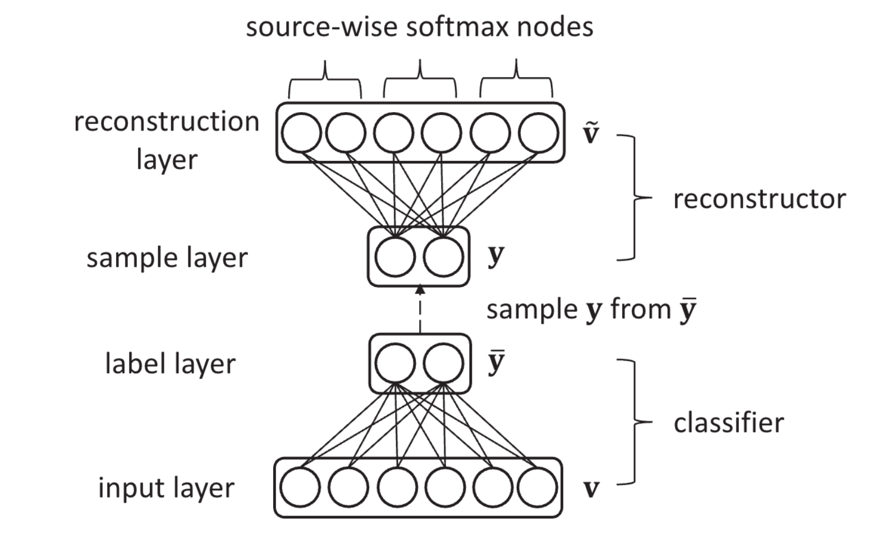

# Aggregating Crowd Wisdoms with Label-aware Autoencoders

[Paper](https://www.researchgate.net/publication/318830014_Aggregating_Crowd_Wisdoms_with_Label-aware_Autoencoders)

## How inference works:

* Split the dataset into training and validation parts
* Start training model
* When loss on validation part starts to increase authors stop training
    * No explicit stopping strategy has been given by the authors
    * So we stop training after max patience step succeeded
* To find a final solution we should use hyperparameters search using validation loss

### Accuracy - validation loss:

| dataset | LAA-B | Majority Vote | LAA-B(Paper) | 
| ---- | --- | --- | --- |
| bluebirds | 0.8056 | 0.7593 | 0.889 | 
| syntetic overlap 3 n_classes 3 n_tasks 5000 | 0.8932 | 0.9006 | 
| syntetic overlap 2 n_classes 3 n_tasks 5000 | 0.777 | 0.7892 | 

## P.S.

It looks like you could achieve greater results in case of using golden labeled data for the best model search:

### Accuracy - validation via golden dataset:
| dataset | LAA-B | Majority Vote |
| ---- | --- | --- |
| bluebirds | 0.907 | 0.7674 | 
| syntetic overlap 3 n_classes 3 n_tasks 5000 | 0.8998 | 0.8985 |
| syntetic overlap 2 n_classes 3 n_tasks 5000 | 0.8085 | 0.7822 |

## Wandb Sweeps
* [bluebirds](https://wandb.ai/martins0n/laa/sweeps/i87vtebk)
* [syntetic overlap 3 n_classes 3](https://wandb.ai/martins0n/laa/sweeps/4kk1c6ei)
* [syntetic overlap 2 n_classes 3](https://wandb.ai/martins0n/laa/sweeps/nr1ib8n8)